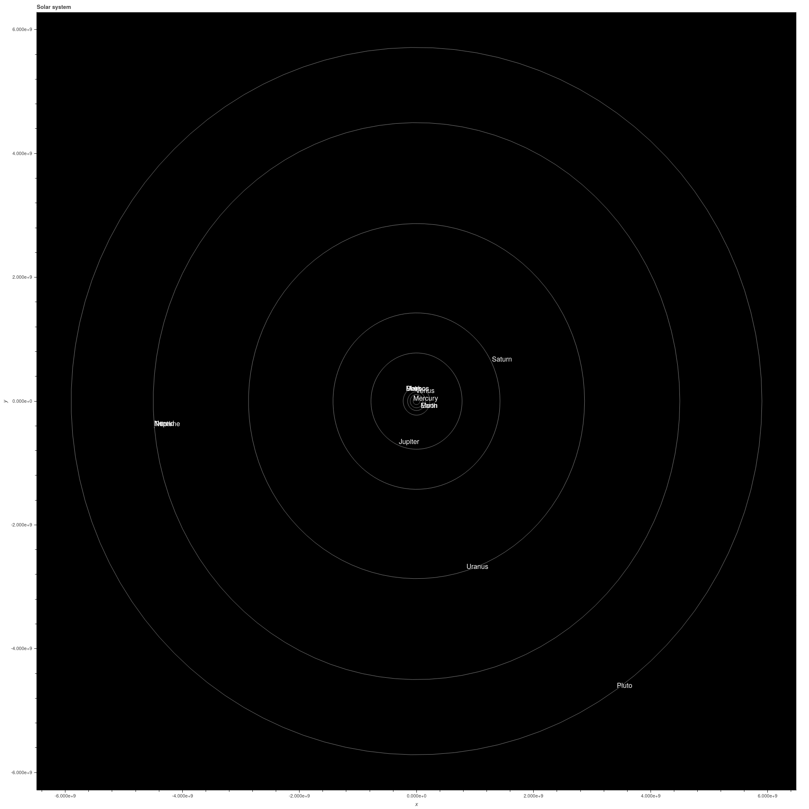

# Solar

Representation of the solar system written in python with Bokeh library.

To execute:

```
git clone https://github.com/cmite/solar.git
cd solar
pip install -r requirements.txt
python main.py
```

Output:

